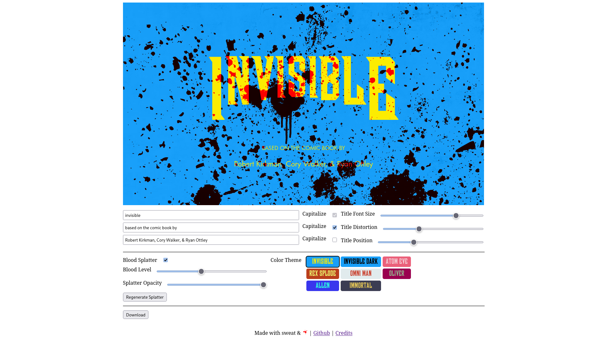

# Invisible Title Maker
Simple tool to create an Invincible TV show inspired title card image.

[insert link here]

- Write any text in the show-inspired title card format
- Multiple color themes based on characters
- Randomized blood splatter with adjustable levels
- Download as PNG

# Credits
- [Wood Block CG Font](https://www.fontpalace.com/font-download/wood-block-cg/)
- [Futura Font](https://www.dafontfree.io/futura-font-free/)
- [Font Meme](https://fontmeme.com/invincible-tv-series-font/)
- [Background Image](https://www.reddit.com/r/MemeTemplatesOfficial/comments/vqwr0r/comment/iewarss/?utm_source=share&utm_medium=web3x&utm_name=web3xcss&utm_term=1&utm_content=share_button)
- [Blood Splatter by Vecteezy](https://www.vecteezy.com/free-vector/blood-splatter)
- [Fine splatter by FreeSVG](https://freesvg.org/)
- [Base64 Conversion by Base64.Guru](https://base64.guru/converter/encode/file)